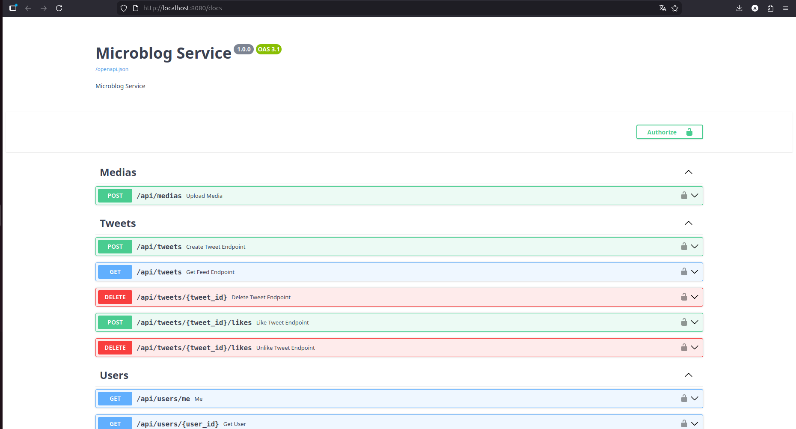
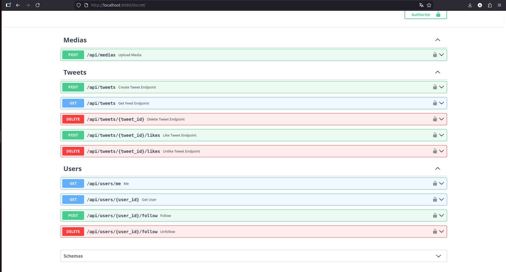
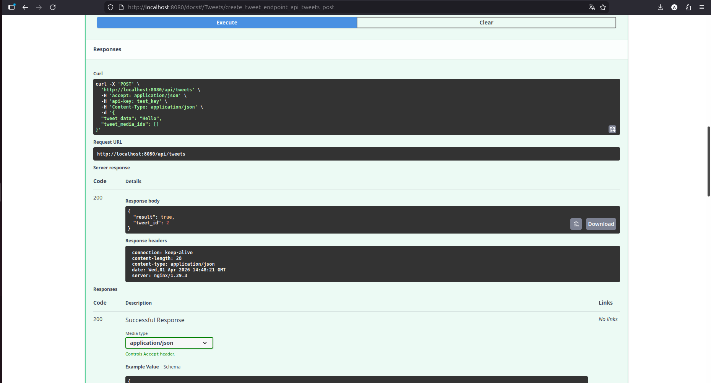
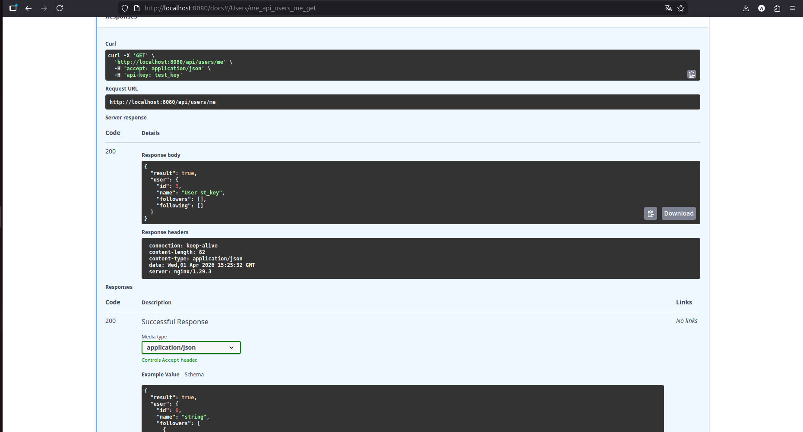
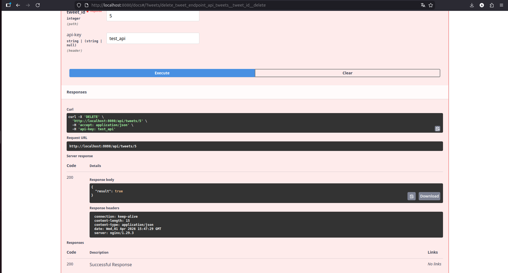

# Microblog Service — дипломный проект (Python Advanced, Skillbox)

Упрощённый аналог Twitter, реализованный на **FastAPI** с отдельным 21фронтендом (готовая сборка Twitter-клона) и запуском через **Docker Compose**.
ьл с

---

## 📌 Возможности сервиса

Приложение представляет собой микроблог, где пользователи могут:

- просматривать свой профиль и профили других пользователей;
- подписываться / отписываться (follow / unfollow);
- создавать твиты;
- прикреплять к твиту медиафайлы;
- ставить лайки и снимать лайки;
- просматривать ленту твитов от тех, на кого подписан;
- удалять свои твиты.

Фронтенд (папка `frontend/`) — это готовый Twitter-clone, который:

- отдаётся через **nginx**;
- ходит к бекэнду по `/api/...` (через прокси `nginx → app:8000`).

---

## 🧱 Стек технологий

| Технология              | Назначение                  |
|-------------------------|-----------------------------|
| Python 3.12             | основной язык               |
| FastAPI                 | REST API                    |
| Uvicorn                 | ASGI-сервер                 |
| PostgreSQL              | СУБД                        |
| SQLAlchemy              | ORM                         |
| Alembic                 | миграции БД                 |
| Pydantic                | схемы и валидация           |
| Docker, docker-compose  | контейнеризация             |
| nginx                   | фронтенд + reverse-proxy    |
| Swagger / OpenAPI       | документация API            |

---

## 📁 Структура проекта (основное)

```text
.
├── alembic/                 # миграции БД
│   └── versions/
├── alembic.ini
├── app/
│   ├── main.py              # точка входа FastAPI
│   ├── config.py            # настройки (в т.ч. из .env)
│   ├── database.py          # подключение к БД
│   ├── crud.py              # слой работы с БД
│   ├── deps.py              # зависимости FastAPI
│   ├── schemas.py           # Pydantic-схемы
│   ├── models/              # ORM-модели
│   │   ├── base.py
│   │   ├── user.py
│   │   ├── tweet.py
│   │   └── follow.py
│   └── routers/             # маршруты API
│       ├── users.py         # /api/users/...
│       ├── tweets.py        # /api/tweets/...
│       └── medias.py        # /api/medias/...
├── frontend/                # собранный фронтенд (Twitter-clone)
│   ├── index.html
│   ├── css/
│   └── js/
├── nginx/
│   └── nginx.conf           # конфиг nginx (фронт + прокси на API)
├── media/                   # папка для загруженных медиа
├── tests/
│   └── test_api.py
├── docker-compose.yml
├── Dockerfile
├── pyproject.toml
└── README.md


⚙️ Как работает приложение

Приложение состоит из трёх частей:

-Бэкенд (FastAPI) — реализует REST API для работы с пользователями, твитами, медиа и лайками.
-База данных (PostgreSQL) — хранит пользователей, твиты, связи подписок, лайки и пути к медиафайлам.
-Фронтенд (готовый twitter-clone) — одностраничное приложение, которое общается с бэкендом через HTTP-запросы.
-Фронтенд работает на порту 8080, бэкенд — внутри Docker на порту 8000, доступ к API и Swagger идёт через Nginx по адресу http://localhost:8080.


🚀 Как запустить проект
1. Клонировать репозиторий
git clone https://gitlab.skillbox.ru/anastasiya_pavlova/python_advanced_diploma.git
cd python_advanced_diploma/Diplom

2. Создать файл окружения .env
В корне папки Diplom уже есть пример:
cp .env.example .env
В файле .env необходимо заполнить основные переменные (по аналогии с .env.example), например:
POSTGRES_DB=microblog
POSTGRES_USER=microblog
POSTGRES_PASSWORD=microblog
POSTGRES_HOST=db
POSTGRES_PORT=5432

API_KEY_K1=test
API_KEY_K2=test2


3. Запустить сервисы через Docker Compose
docker compose up --build
# или, если у вас старая версия Docker:
# docker-compose up --build

Docker поднимет:
контейнер с PostgreSQL,
контейнер с бэкендом FastAPI,
контейнер с nginx, который раздаёт фронтенд и проксирует запросы к API.

4. Применить миграции БД (если требуется вручную)
Если миграции не применяются автоматически, выполните:
docker compose exec app alembic upgrade head


5. Открыть приложение в браузере

Фронтенд микроблога:
http://localhost:8080
Документация Swagger (через nginx):
http://localhost:8080/docs


🔑 Авторизация
Фронтенд сам добавляет заголовок api-key со значением test (или тем, что указано в .env) при обращении к API.
На уровне бэкенда в итоговом варианте нет жёсткой проверки API-ключа, а проверка наличия api-key реализована на стороне фронтенда, как предусмотрено заданием.
::contentReference[oaicite:0]{index=0}

# Microblog Service
Backend-сервис микроблогов (аналог Twitter), реализованный на FastAPI.
Позволяет создавать твиты, лайкать их, подписываться на пользователей и работать с медиа.


### API документация (Swagger)
Интерактивная документация API, позволяющая тестировать эндпоинты сервиса: создание твитов, лайки, загрузка медиа и получение данных пользователей.




### Создание твита через API
Пример выполнения POST-запроса для создания твита через Swagger UI с передачей данных и получением ответа от сервера.



### Получение текущего пользователя
Endpoint возвращает информацию о текущем пользователе по API-ключу.



### Удаление твита через API
Пример выполнения DELETE-запроса для удаления собственного твита через Swagger UI.
